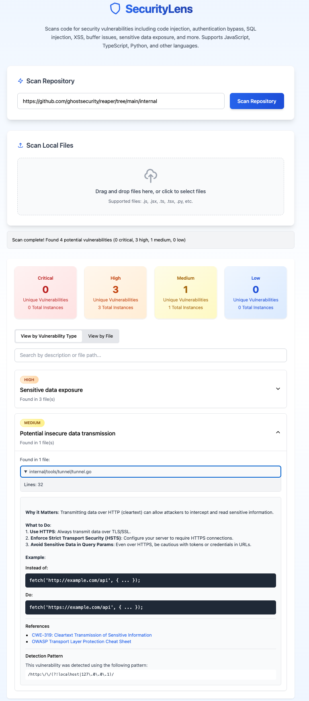

# SecurityLens

[Live Demo](https://securitylens.netlify.app/){: .btn .btn-primary }
{: .text-center }

An open-source security analysis platform for education and vulnerability discovery.

## Live Tool

<iframe
    src="https://securitylens.netlify.app"
    width="100%"
    height="800px"
    style="border: 1px solid #ccc; border-radius: 4px;"
    frameborder="0"
    allow="clipboard-write">
</iframe>

## Current Features

- Static code analysis for common security vulnerabilities
- Pattern-based vulnerability detection
- Detailed explanations and recommendations

## Roadmap

### Phase 1 (Current)
{: .no_toc }

- [x] Basic vulnerability scanning
- [x] CVE database integration
- [ ] Dependency vulnerability checking

### Phase 2 (Future)
{: .no_toc }

- [ ] Binary analysis capabilities
- [ ] Integration with reverse engineering tools
- [ ] Interactive learning modules

### Phase 3 (Long-term)
{: .no_toc }

- [ ] Collaborative analysis features
- [ ] Integration with additional security tools
- [ ] Advanced binary analysis

## Current Results Page Example

{: .text-center }