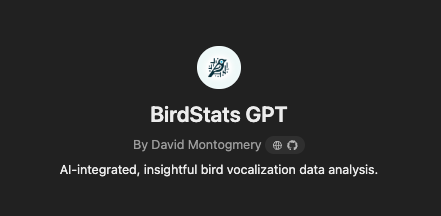

# BirdStatsGPT

**[Play With It Here](https://chat.openai.com/g/g-G8R6D6ufP-birdstats-gpt)**

## Introduction

Hey there! Love birds? Running a BirdNET-Pi station? This GPT is your new birding buddy. 

BirdStatsGPT can help you make sense of all your bird data by connecting your BirdNET-Pi/BirdWeather detections with eBird's massive database. Just chat with it naturally - no need to deal with APIs or complex queries.

Ask things like:
- "My BirdNET heard a Swainson's Thrush this morning - is that unusual for my area?"
- "What's the rarest bird my station detected this week?"
- "Are the American Goldfinches my station keeps hearing also being reported on eBird?"
- "Cross-reference my station's detections with historical eBird data for my county"

It does all the heavy lifting of querying APIs and analyzing the data. You just need your BirdNET-Pi station token to get started!

## Authentication

### BirdNET-Pi / Birdweather API
Currently, you can include your station token directly in the query parameter. While this works, it's worth noting this might be adjusted in future updates for better security practices.

### eBird API
Public research token, no need to anything on your end. The token is securely stored within the system.

[Technical API documentation below for the curious, but you don't need any of this to use me - just chat naturally!]

## API Documentation

### BirdWeather API Endpoints

#### Station Stats
    GET /api/v1/stations/{token}/stats

*Parameters:*
- `period` (optional): day/week/month/all (default: day) 
- `since` (optional): ISO8601 timestamp

#### Station Species
    GET /api/v1/stations/{token}/species

*Parameters:*
- `period` (optional): day/week/month/all (default: day)
- `since` (optional): ISO8601 timestamp
- `limit` (optional): max 100
- `page` (optional): page number
- `sort` (optional): common_name/scientific_name/top
- `order` (optional): asc/desc
- `speciesId` (optional): filter by species ID
- `query` (optional): search query
- `locale` (optional): language locale

#### Detections
    POST /api/v1/stations/detections
    GET /api/v1/stations/{token}/detections
    GET /api/v1/stations/{token}/detections/{id}

#### Soundscapes
    POST /api/v1/stations/{token}/soundscapes
    GET /api/v1/stations/{token}/soundscapes
    GET /api/v1/stations/{token}/soundscapes/{id}

#### Species Information
    GET /api/v1/species/{id}
    POST /api/v1/species/lookup

#### Station Configuration
    POST /api/v1/stations/{token}/config

### eBird API Endpoints

#### Observations
    GET /data/obs/{region}/notable/historic/{yyyymmdd}
    GET /data/obs/{region}/recent
    GET /data/obs/{region}/recent/notable
    GET /data/obs/{region}/recent/{speciesCode}
    GET /data/obs/hotspot/{hotspotCode}/recent
    GET /data/obs/location/{locationId}/recent
    GET /data/obs/geo/recent

#### Reference Data
    GET /ref/region/list/{regionType}/{parentRegionCode}
    GET /ref/region/info/{regionCode}
    GET /ref/hotspot/info/{hotspotCode}
    GET /ref/taxonomy/ebird
    GET /ref/taxonomy/ebird/{speciesCode}
    GET /product/spplist/{region}

#### Checklists
    GET /product/checklist/view/{subId}
    GET /product/checklist/feed/{region}
    GET /data/obs/{region}/historic/{yyyymmdd}

#### Statistics
    GET /ref/region/stats/{regionCode}

