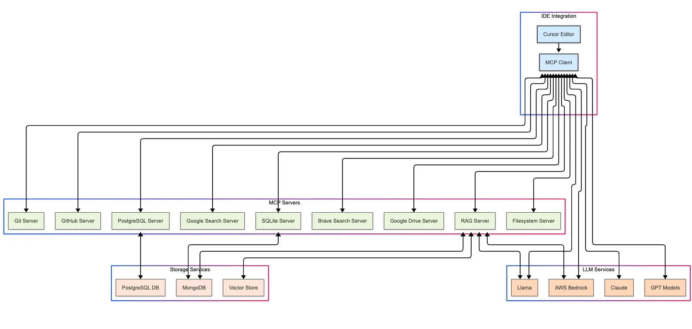
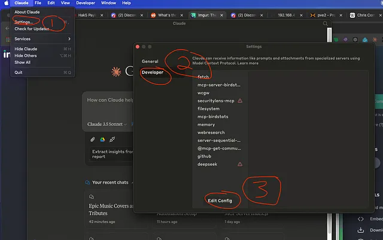
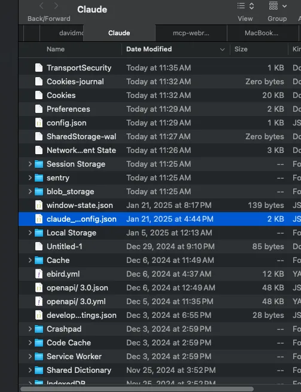
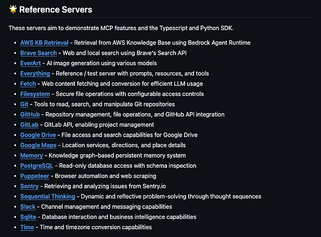
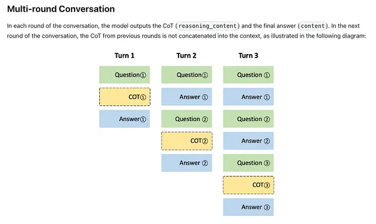

# DeepSeek MCP Server: Circumventing "Server Busy" Errors and Keeping Your Data Private

*Originally published on [Medium](https://medium.com/@dmontg/deepseek-mcp-server-circumventing-server-busy-errors-and-keeping-your-data-private) - February 2025*

By David Montgomery, SecurityLens.io

DeepSeek MCP Server offers a robust way to bypass the frustrating "server busy" errors you encounter at DeepSeek.com.
Beyond its reliability, it also protects your data from being sent to foreign governments by routing everything through Anthropic's servers.

<div class="video-container">
    <iframe width="560" height="315" src="https://www.youtube.com/embed/sahlsDPi5nE" frameborder="0" allowfullscreen></iframe>
</div>

## Overview

This article covers:

- What MCP (Model Context Protocol) is and how to quickly get it running
- What DeepSeek MCP Server is, how it integrates with the Model Context Protocol (MCP)
- Why MCP is a must have and how it will change your life forever... maybe we'll start with just installing it though

## A couple of disclaimers

Above, there is a side-by-side screen recording. The video used a regular web interface for DeepSeek for comparison sake, but please note that I took extreme precautions. Generally, you should not use the standard DeepSeek.com web interface.

Second...

> ***This article isn't really about DeepSeek...***

DeepSeek happens to be the trending topic right now — so I'm using it to get your attention and showcase the open-source potential of Model Context Protocol).

However — if you are sick of "server busy" you are in the right place!

## Why Do Anthropic Servers Work When Yours Don't?

It's technically complex, but the short version is: They just do. Yes, it can be slightly slower, but reliability often trumps speed.

On top of that, the DeepSeek MCP integration includes fallback mechanisms and optimizations in the API call process. I'm still working on streaming Chain-of-Thought (CoT) — I hope to wrap that up soon, but some elements lie outside my control.

> Note: You might notice that in the MCP GUI in the screen recording, the final output is Claude's summary of "R1's" output. This summarization is extremely helpful for quick reference, but you can still see the full output by expanding the relevant field arrow.

## What Is MCP (Model Context Protocol)?

MCP is an open-source protocol released by Anthropic in November 2024. It is not a language model nor a cloud-based service. In other words, it's not comparable to tools like ChatGPT or AWS or much of anything else.



Think of MCP as a "universal connector" — a protocol that lets different services interact.

### Installing MCP on Claude Desktop

1. Download Node.js
2. Download Claude Desktop
   
3. Go to settings, Developer, Edit Config
   

4. This will popup after you hit Edit Config

5. Open this up with some kind of code editor that will correct any errors (and text editor will technically work), and paste in:

```json
"mcpServers": {
    "mcp-installer": {
      "command": "npx",
      "args": [
        "@anaisbetts/mcp-installer"
      ]
    }
  }
```

6. Now that you have this magical little server, you can install others with natural language:
   

Shout out to [anaisbetts/mcp-installer](https://github.com/anaisbetts/mcp-installer) for this magic!

The server maintains context across multiple exchanges, preserving configuration settings throughout.
I just want to pause to highlight an important point, maybe the whole point, of the Model Context Protocol. Nearly everything is done just like this, with natural language.

> When people hear about what MCP can do, there is a natural tendency to shrug and thing, “cool, another thing that does stuff I can already do with a little work and some code”

Natural language communication between your CRM, your mongobd instance, your web browser, your playwright crawler, your everything else — you just a text field and words — that’s it.

## Reference Servers



## DeepSeek Integration with MCP

DeepSeek and MCP integration is far more than a simple chatbot. Here are some additional perks and features:

### Anonymous Use of the DeepSeek API

Through proxying, the other side only sees a generic request from Anthropic, keeping your identity private.

You can use Dev Tools with Claude Desktop! If you ever have any doubt about who is REALLY making the API calls and what is being shown, it's all right here, every header, response, parameter, and payload.


### Multi-Turn Conversations




### Natural Language Configuration

The server interprets your natural language requests and automatically maps them to the correct configurations:


### Coming Soon: Running Models Locally with MCP

Stay tuned for Part 2, where we'll explore how to run the model locally and still harness the power of MCP. This is perfect for those who want search ability with a locally hosted model.

---

*This is a detailed guide on setting up and using the DeepSeek MCP Server. For more information, check out the [GitHub repository](https://github.com/DMontgomery40/deepseek-mcp-server).*
